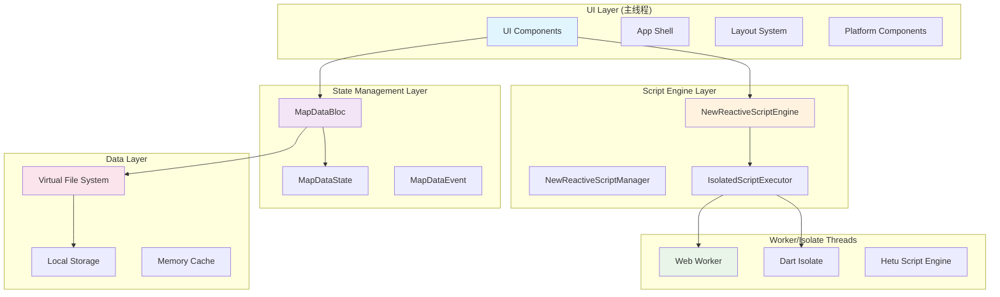
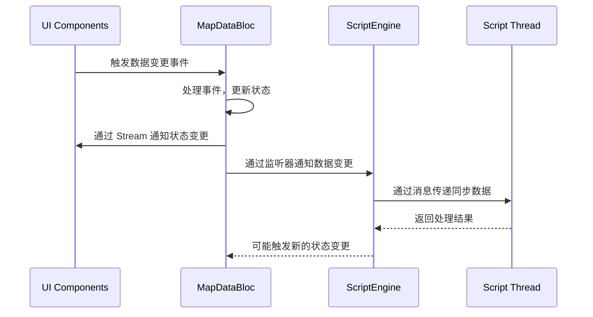
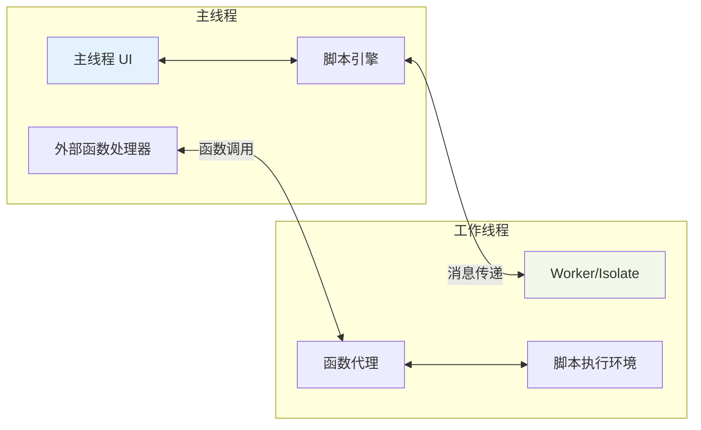
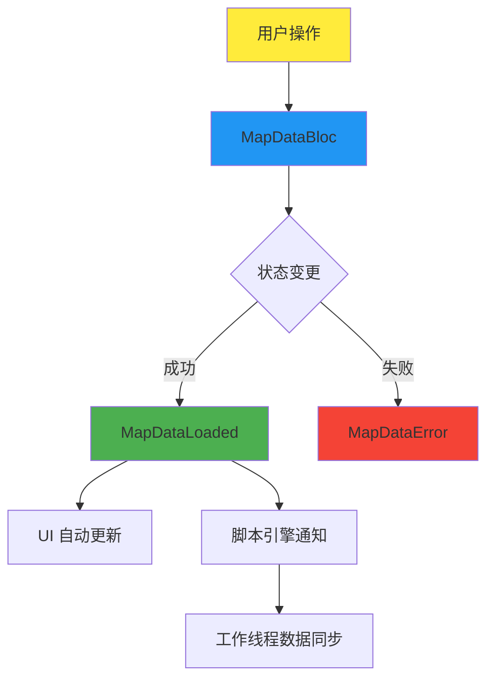

# R6Box 架构设计文档

## 🏗️ 架构概述

R6Box 是一个基于 Flutter 的跨平台地图编辑器，采用现代化的响应式架构设计，支持 Windows、Web、Android、iOS、macOS 和 Linux 等多个平台。系统核心特性包括：

- **响应式数据流架构**：基于 Bloc 模式的状态管理
- **异步脚本执行引擎**：支持 Isolate/WebWorker 的多线程脚本执行
- **跨平台适配**：平台感知的组件系统
- **虚拟文件系统**：统一的文件存储抽象层

## 📊 整体架构图



## 🎯 核心架构组件

### 1. UI 层架构

#### 1.1 跨平台适配系统
```dart
// 平台感知组件系统
PlatformAwareComponent
├── WindowsComponent    // Windows 原生特性
├── WebComponent        // Web 特定功能
├── AndroidComponent    // Android Material 设计
├── IOSComponent        // iOS Cupertino 设计
├── MacOSComponent      // macOS 原生UI
└── LinuxComponent      // Linux GTK 集成
```

#### 1.2 布局系统
- **AppShell**: 应用程序外壳，管理整体布局
- **MainLayout**: 主要内容区域布局
- **TrayNavigation**: 跨平台导航系统
- **ResponsiveLayout**: 响应式布局适配

### 2. 响应式数据流架构

#### 2.1 状态管理核心
```dart
MapDataBloc (核心状态管理器)
├── MapDataState        // 状态定义
│   ├── MapDataInitial
│   ├── MapDataLoading
│   ├── MapDataLoaded
│   └── MapDataError
├── MapDataEvent        // 事件定义
│   ├── LoadMapData
│   ├── UpdateLayer
│   ├── AddDrawingElement
│   └── SaveMapData
└── 数据变更监听器集合  // 响应式通知机制
```

#### 2.2 数据同步机制


### 3. 异步脚本执行引擎

#### 3.1 多线程执行架构
```dart
NewReactiveScriptEngine (脚本引擎)
├── IsolatedScriptExecutor (抽象执行器)
│   ├── IsolateScriptExecutor (桌面端 - Dart Isolate)
│   └── WebWorkerScriptExecutor (Web端 - JavaScript Worker)
├── 外部函数注册系统
├── 消息传递机制
└── 超时和错误处理
```

#### 3.2 线程间通信机制


#### 3.3 消息类型系统
```dart
enum ScriptMessageType {
  execute,              // 执行脚本
  result,               // 执行结果
  error,                // 错误信息
  log,                  // 日志输出
  stop,                 // 停止执行
  mapDataUpdate,        // 地图数据更新
  externalFunctionCall, // 外部函数调用
}
```

### 4. 线程分配策略

#### 4.1 主线程职责
- **UI 渲染**：Flutter Widget 树渲染
- **状态管理**：Bloc 状态处理和事件分发
- **用户交互**：触摸、鼠标、键盘事件处理
- **外部函数处理**：脚本调用的外部函数实际执行

#### 4.2 工作线程职责
- **脚本执行**：Hetu Script 代码解释执行
- **计算密集任务**：复杂算法和数据处理
- **函数代理**：外部函数调用的消息传递

#### 4.3 平台特定线程模型

**桌面平台 (Windows/macOS/Linux)**
```dart
// 使用 Dart Isolate
Isolate.spawn(_isolateEntryPoint, receivePort.sendPort)
```

**Web 平台**
```javascript
// 使用 Web Worker (计划中)
const worker = new Worker('script_worker.js');
worker.postMessage({type: 'execute', code: scriptCode});
```

### 5. 数据同步机制

#### 5.1 响应式数据流


#### 5.2 线程间数据同步
- **主线程 → 工作线程**：通过消息传递发送最新数据
- **工作线程 → 主线程**：通过回调机制返回处理结果
- **数据一致性**：使用版本号和时间戳确保数据同步

### 6. 跨平台设计

#### 6.1 平台检测和适配
```dart
String getCurrentPlatform() {
  if (kIsWeb) return 'Web';
  
  switch (defaultTargetPlatform) {
    case TargetPlatform.windows: return 'Windows';
    case TargetPlatform.macOS: return 'MacOS';
    case TargetPlatform.linux: return 'Linux';
    case TargetPlatform.android: return 'Android';
    case TargetPlatform.iOS: return 'iOS';
    default: return 'Unknown';
  }
}
```

#### 6.2 平台特定功能
| 平台 | 特性 | 实现方式 |
|------|------|----------|
| Windows | 原生 UI、文件系统、系统托盘 | Windows API 调用 |
| Web | PWA、浏览器存储、URL 路由 | Web APIs |
| Android | Material Design、权限、通知 | Android 平台通道 |
| iOS | Cupertino Design、App Store | iOS 平台通道 |
| macOS | 菜单栏、Touch Bar | macOS 原生 API |
| Linux | GTK 集成、包管理 | Linux 系统调用 |

#### 6.3 Web 多线程执行器设计 (计划中)

```javascript
// Web Worker 脚本执行器
class ScriptWorker {
  constructor() {
    this.worker = new Worker('hetu_script_worker.js');
    this.setupMessageHandling();
  }
  
  execute(scriptCode, context) {
    return new Promise((resolve, reject) => {
      const messageId = this.generateId();
      
      this.worker.postMessage({
        type: 'execute',
        id: messageId,
        code: scriptCode,
        context: context
      });
      
      // 处理响应...
    });
  }
}
```

### 7. 虚拟文件系统 (VFS)

#### 7.1 VFS 架构
```dart
VirtualFileSystem
├── VfsMapService          // 地图数据服务
├── VfsStorageService      // 存储服务
├── LegendVfsService       // 图例服务
└── 平台适配层
    ├── WebVfsAdapter      // Web 本地存储
    ├── MobileVfsAdapter   // 移动端文件系统
    └── DesktopVfsAdapter  // 桌面端文件系统
```

#### 7.2 数据存储策略
- **Web**: IndexedDB + LocalStorage
- **移动端**: SQLite + 应用沙盒
- **桌面端**: SQLite + 本地文件系统

## 🔧 技术实现细节

### 1. 脚本引擎初始化流程
```dart
// 1. 创建脚本引擎
final scriptEngine = NewReactiveScriptEngine(mapDataBloc: mapDataBloc);

// 2. 初始化异步执行器
await scriptEngine.initializeScriptEngine();

// 3. 注册外部函数
scriptEngine.registerExternalFunctions();

// 4. 开始监听数据变更
scriptEngine._initialize();
```

### 2. 外部函数注册机制
```dart
void _registerExternalFunctions() {
  // 基础函数
  _scriptExecutor!.registerExternalFunction('log', _handleLog);
  _scriptExecutor!.registerExternalFunction('print', _handleLog);
  
  // 数学函数
  _scriptExecutor!.registerExternalFunction('sin', _handleSin);
  _scriptExecutor!.registerExternalFunction('cos', _handleCos);
  
  // 地图数据访问函数
  _scriptExecutor!.registerExternalFunction('getLayers', _handleGetLayers);
  _scriptExecutor!.registerExternalFunction('getLayerById', _handleGetLayerById);
  
  // 文件操作函数
  _scriptExecutor!.registerExternalFunction('readjson', _handleReadJson);
  _scriptExecutor!.registerExternalFunction('writetext', _handleWriteText);
}
```

### 3. 消息传递协议
```dart
class ScriptMessage {
  final ScriptMessageType type;
  final Map<String, dynamic> data;
  
  ScriptMessage({required this.type, required this.data});
  
  Map<String, dynamic> toJson() => {
    'type': type.name,
    'data': data,
  };
  
  factory ScriptMessage.fromJson(Map<String, dynamic> json) => ScriptMessage(
    type: ScriptMessageType.values.byName(json['type']),
    data: json['data'],
  );
}
```

## 🚀 性能优化策略

### 1. 内存管理
- **对象池**：复用频繁创建的对象
- **弱引用**：避免循环引用导致的内存泄漏
- **懒加载**：按需加载组件和数据

### 2. 渲染优化
- **虚拟化列表**：大数据集的高效渲染
- **差分更新**：只更新变化的部分
- **帧率控制**：保持 60fps 的流畅体验

### 3. 异步处理
- **非阻塞执行**：所有耗时操作都在工作线程执行
- **批量处理**：合并多个小操作为批量操作
- **预加载**：提前加载可能需要的资源

## 🔒 安全性考虑

### 1. 脚本安全
- **沙盒执行**：脚本在隔离环境中运行
- **API 限制**：只允许访问预定义的外部函数
- **超时保护**：防止脚本无限期运行

### 2. 数据安全
- **输入验证**：所有用户输入都经过验证
- **权限控制**：基于平台的权限管理
- **数据加密**：敏感数据的加密存储

## 📈 扩展性设计

### 1. 插件系统 (计划中)
- **插件接口**：标准化的插件开发接口
- **动态加载**：运行时加载和卸载插件
- **依赖管理**：插件间的依赖关系管理

### 2. 主题系统
- **动态主题**：支持亮色/暗色主题切换
- **自定义主题**：用户可自定义界面风格
- **平台适配**：主题自动适配平台风格

## 🛠️ 开发工具和调试

### 1. 调试支持
- **日志系统**：分级日志记录
- **性能监控**：实时性能指标
- **错误追踪**：详细的错误堆栈信息

### 2. 开发者工具
- **脚本调试器**：脚本执行的断点调试
- **状态检查器**：实时查看应用状态
- **网络监控**：API 调用的监控和分析

## 📋 测试策略

### 1. 单元测试
- **业务逻辑测试**：核心业务逻辑的单元测试
- **组件测试**：UI 组件的独立测试
- **工具函数测试**：辅助函数的测试覆盖

### 2. 集成测试
- **跨平台测试**：在所有目标平台上的集成测试
- **性能测试**：不同设备上的性能基准测试
- **用户体验测试**：真实用户场景的测试

## 🔮 未来规划

### 1. 短期目标
- [ ] 完成 Web Worker 脚本执行器
- [ ] 优化脚本执行性能
- [ ] 增加更多外部函数 API
- [ ] 完善错误处理机制

### 2. 中期目标
- [ ] 实现插件系统
- [ ] 添加脚本调试器
- [ ] 支持更多地图格式
- [ ] 增强跨平台特性

### 3. 长期目标
- [ ] AI 辅助脚本编写
- [ ] 云端协作功能
- [ ] 移动端优化
- [ ] 企业级部署方案

## 📚 技术栈总结

| 层级 | 技术栈 | 说明 |
|------|--------|------|
| UI框架 | Flutter | 跨平台UI框架 |
| 状态管理 | Bloc | 响应式状态管理 |
| 脚本引擎 | Hetu Script | 轻量级脚本语言 |
| 多线程 | Isolate/WebWorker | 异步执行环境 |
| 数据库 | SQLite | 本地数据存储 |
| 文件系统 | VFS | 虚拟文件系统抽象 |
| 国际化 | Flutter Intl | 多语言支持 |
| 测试 | Flutter Test | 单元和集成测试 |

---

**文档版本**: v1.0  
**最后更新**: 2025年6月17日  
**架构负责人**: R6Box 开发团队  
**适用版本**: R6Box v2.0+  

此架构设计文档将随着项目发展持续更新和完善。
