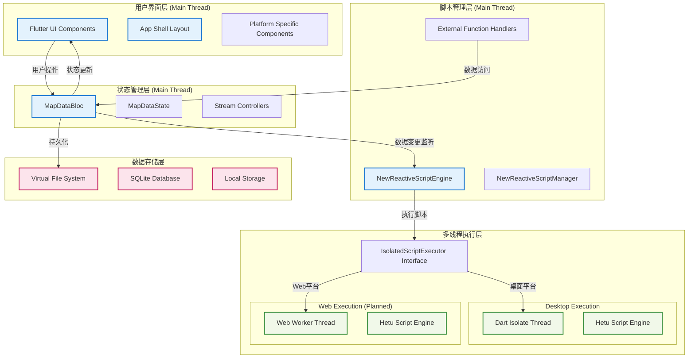
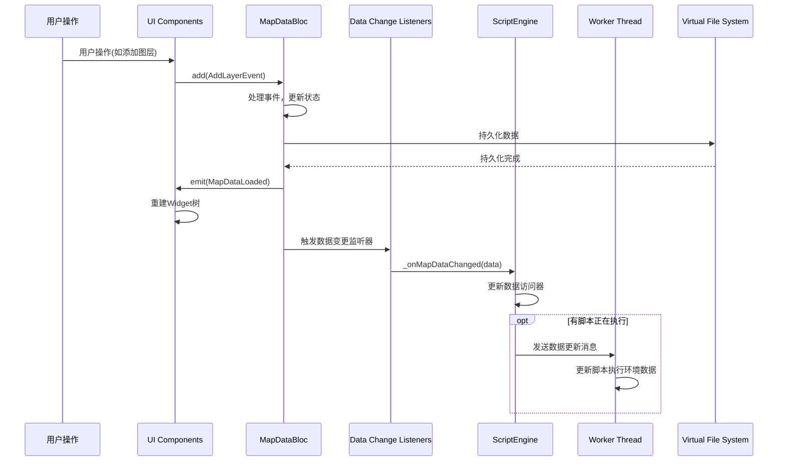
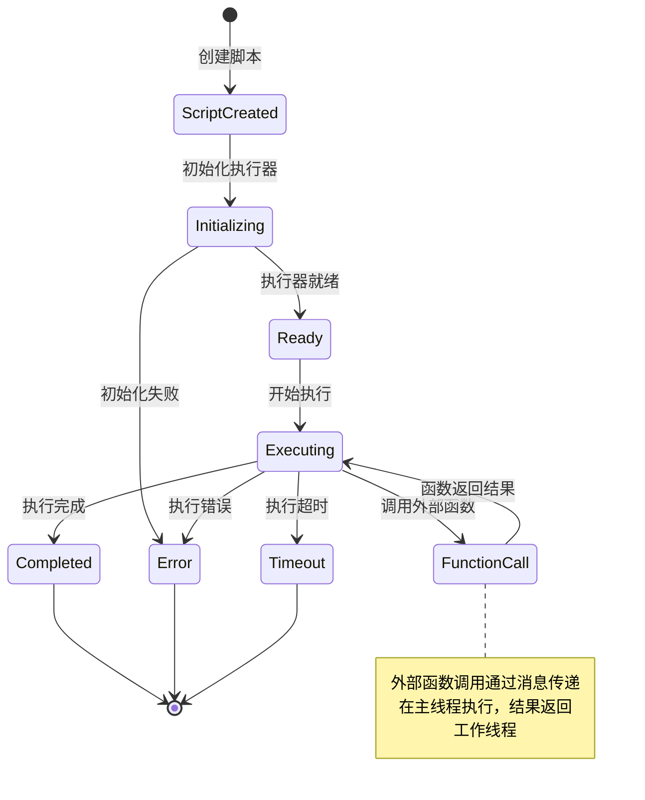
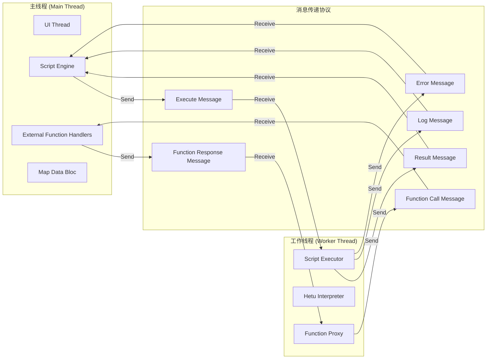
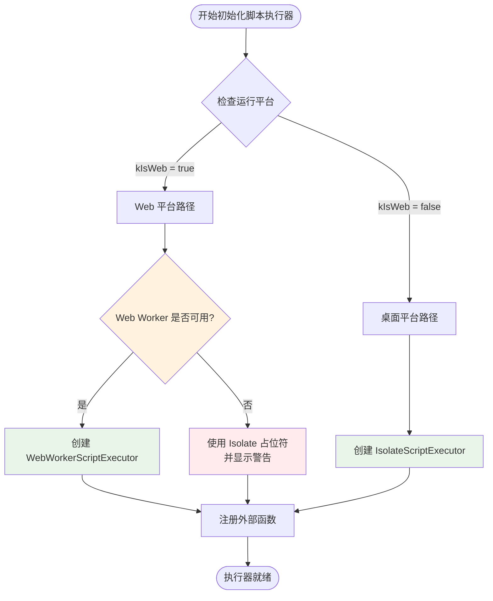
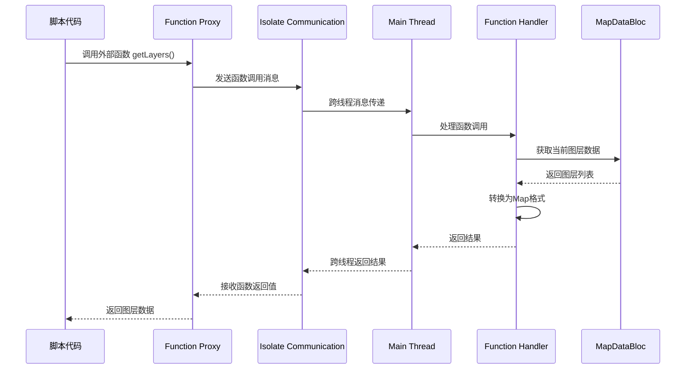
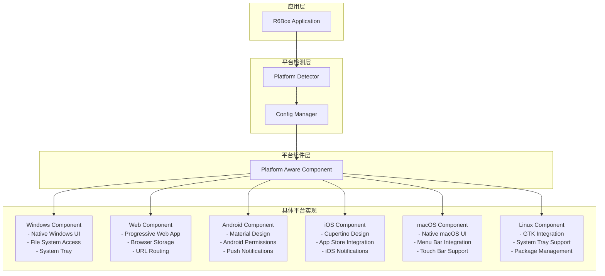
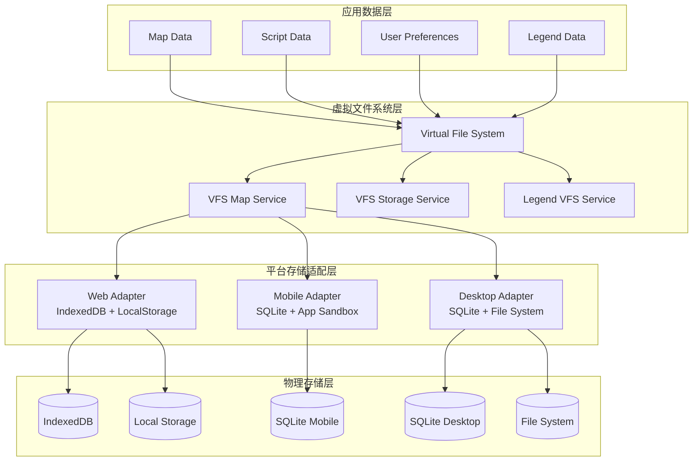
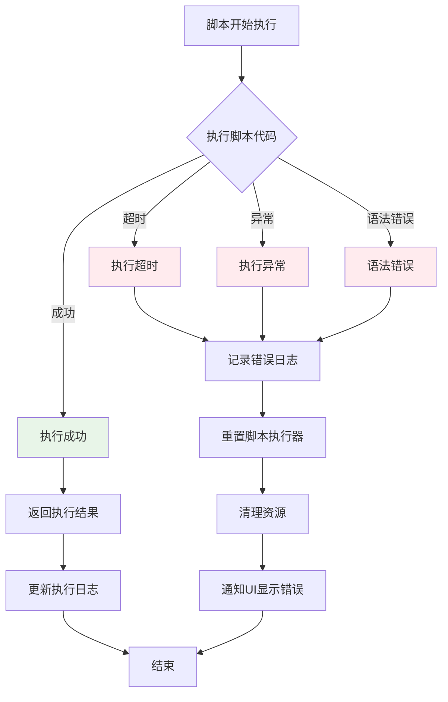
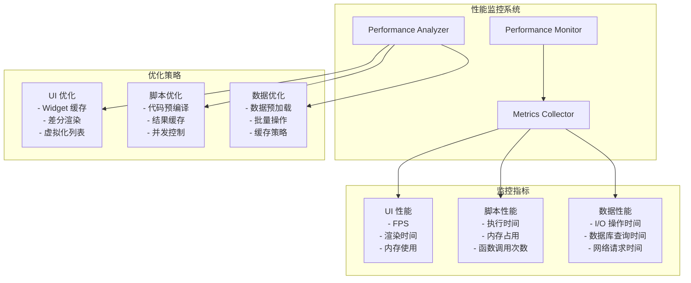

# R6Box 系统交互流程图

## 1. 整体数据流架构图

## 2. 响应式数据同步详细流程

## 3. 脚本执行生命周期

## 4. 线程间通信机制

## 5. 跨平台执行器选择流程

## 6. 外部函数调用流程

## 7. 平台适配架构

## 8. 数据持久化架构

## 9. 错误处理和恢复机制

## 10. 性能监控流程

---

这些流程图详细展示了 R6Box 系统中各个组件之间的交互关系，包括：

1. **数据流架构**：展示了从UI到存储的完整数据流
2. **响应式同步**：说明了数据变更如何实时同步到各个组件
3. **脚本执行**：描述了脚本从创建到执行完成的整个生命周期
4. **线程通信**：详细说明了主线程和工作线程之间的消息传递机制
5. **平台适配**：展示了如何根据不同平台选择相应的实现
6. **数据持久化**：说明了数据如何通过VFS层适配到不同平台的存储系统
7. **错误处理**：描述了系统如何处理各种异常情况
8. **性能监控**：展示了性能监控和优化的完整流程

这套架构设计确保了系统的可扩展性、可维护性和跨平台兼容性。
